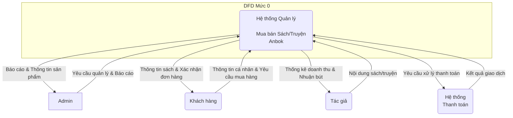
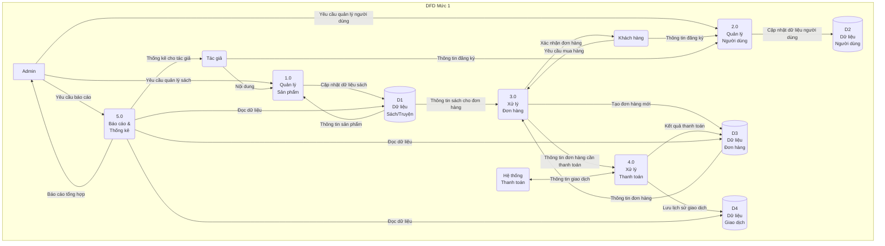
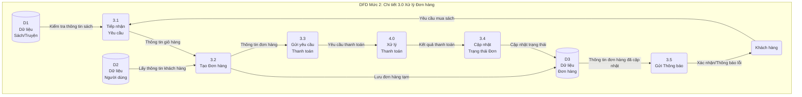
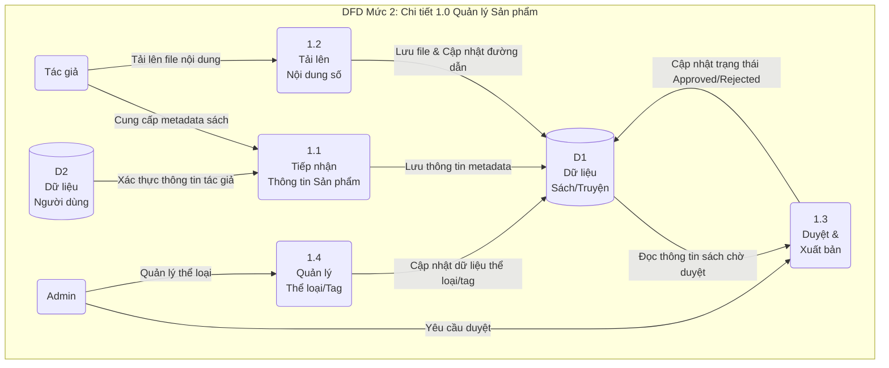

# DFD Luồng dữ liệu - Quản lý Mua bán Sách và Truyện (Anbok)

Tài liệu này mô tả Luồng dữ liệu (Data Flow Diagram - DFD) cho hệ thống con "Quản trị mua bán sách và truyện" của dự án Anbok ở các mức 0, 1 và 2.

**Lưu ý:** Các biểu đồ được viết bằng cú pháp Mermaid. Bạn có thể sao chép mã trong các khối ```mermaid ... ``` và dán vào các trình chỉnh sửa hỗ trợ (như VS Code với plugin, Obsidian) hoặc import vào Draw.io/diagrams.net qua menu `Arrange > Insert > Advanced > Mermaid...`.

---

## DFD Mức 0 - Sơ đồ Ngữ cảnh (Context Diagram)

Sơ đồ mức 0 thể hiện toàn bộ hệ thống như một tiến trình duy nhất và cho thấy các luồng dữ liệu chính giữa hệ thống với các tác nhân bên ngoài.

**Tác nhân bên ngoài:**
*   **Admin:** Quản trị viên hệ thống.
*   **Khách hàng:** Người dùng cuối mua và đọc sách/truyện.
*   **Tác giả:** Người cung cấp nội dung sách/truyện.
*   **Hệ thống Thanh toán:** Cổng thanh toán bên thứ ba (ví dụ: VNPay).



---

## DFD Mức 1 - Sơ đồ Tổng quan (Overview Diagram)

Sơ đồ mức 1 phân rã tiến trình chính ở mức 0 thành các tiến trình con, thể hiện luồng dữ liệu giữa các tiến trình này và các kho dữ liệu (Data Store).

**Các tiến trình chính:**
1.  **Quản lý Sản phẩm:** Thêm, xóa, sửa sách/truyện.
2.  **Quản lý Người dùng:** Quản lý thông tin khách hàng, tác giả.
3.  **Xử lý Đơn hàng:** Tiếp nhận và xử lý yêu cầu mua hàng từ khách.
4.  **Xử lý Thanh toán:** Tích hợp với cổng thanh toán để xác nhận giao dịch.
5.  **Báo cáo & Thống kê:** Tạo báo cáo doanh thu, nhuận bút.

**Kho dữ liệu:**
*   **D1:** Dữ liệu Sách/Truyện
*   **D2:** Dữ liệu Người dùng (Khách hàng, Tác giả)
*   **D3:** Dữ liệu Đơn hàng
*   **D4:** Dữ liệu Giao dịch



---

## DFD Mức 2 - Chi tiết tiến trình "3.0 Xử lý Đơn hàng"

Sơ đồ mức 2 phân rã một tiến trình cụ thể từ mức 1 (ở đây là "Xử lý Đơn hàng") thành các tiến trình chi tiết hơn.

**Các tiến trình con của "3.0 Xử lý Đơn hàng":**
*   **3.1:** Tiếp nhận yêu cầu mua hàng.
*   **3.2:** Tạo đơn hàng tạm.
*   **3.3:** Gửi yêu cầu thanh toán.
*   **3.4:** Cập nhật trạng thái đơn hàng.
*   **3.5:** Gửi thông báo cho khách hàng.



---

## DFD Mức 2 - Chi tiết tiến trình "1.0 Quản lý Sản phẩm"

Sơ đồ này phân rã tiến trình "Quản lý Sản phẩm" để cho thấy cách sách và truyện được thêm, duyệt và quản lý.

**Các tiến trình con của "1.0 Quản lý Sản phẩm":**
*   **1.1:** Tiếp nhận thông tin sản phẩm (metadata như tên sách, tác giả, mô tả).
*   **1.2:** Tải lên & Lưu trữ nội dung số (file PDF, EPUB...).
*   **1.3:** Duyệt và Xuất bản sản phẩm.
*   **1.4:** Quản lý thông tin liên quan (thể loại, tag).

