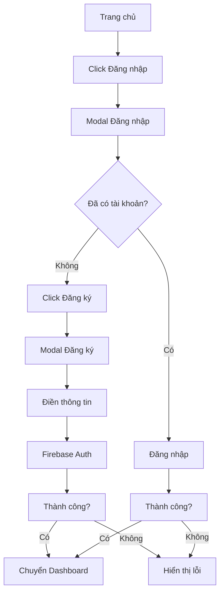
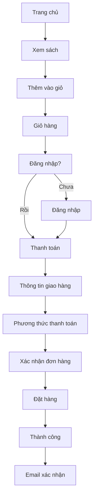
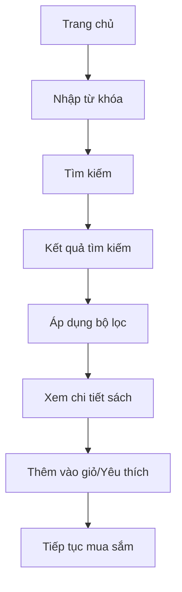

# TÀI LIỆU DỰ ÁN THƯ VIỆN SÁCH
*Document Version: 1.0 | Last Updated: 2024*

---

## MỤC LỤC

1. [Tổng quan dự án](#tổng-quan-dự-án)
2. [Kiến trúc hệ thống](#kiến-trúc-hệ-thống)
3. [Cấu trúc trang web](#cấu-trúc-trang-web)
4. [Luồng người dùng](#luồng-người-dùng)
5. [Tính năng chi tiết](#tính-năng-chi-tiết)
6. [Công nghệ sử dụng](#công-nghệ-sử-dụng)
7. [Hướng dẫn phát triển](#hướng-dẫn-phát-triển)
8. [API Documentation](#api-documentation)
9. [Deployment Guide](#deployment-guide)

---

## TỔNG QUAN DỰ ÁN

### Mục tiêu
Xây dựng một nền tảng thư viện sách trực tuyến hiện đại, cung cấp trải nghiệm mua sắm và đọc sách tốt nhất cho người dùng Việt Nam.

### Đối tượng người dùng
- **Độc giả cá nhân**: Sinh viên, giáo viên, nhân viên văn phòng
- **Thư viện và trường học**: Mua sách giáo khoa, tài liệu tham khảo
- **Quản trị viên**: Quản lý hệ thống, sản phẩm, đơn hàng

### Phạm vi dự án
- Website responsive (Desktop, Tablet, Mobile)
- Hệ thống xác thực người dùng
- Quản lý sản phẩm và đơn hàng
- Hệ thống thanh toán trực tuyến
- Dashboard quản trị

---

## KIẾN TRÚC HỆ THỐNG

### Frontend Architecture
```
┌─────────────────────────────────────────────────────────────┐
│                    PRESENTATION LAYER                      │
├─────────────────────────────────────────────────────────────┤
│  HTML5 + CSS3 + JavaScript + Bootstrap + jQuery           │
├─────────────────────────────────────────────────────────────┤
│                    BUSINESS LOGIC LAYER                    │
├─────────────────────────────────────────────────────────────┤
│  Firebase Authentication + Firestore Database              │
├─────────────────────────────────────────────────────────────┤
│                    INFRASTRUCTURE LAYER                    │
├─────────────────────────────────────────────────────────────┤
│  Firebase Hosting + CDN + Analytics                       │
└─────────────────────────────────────────────────────────────┘
```

### Technology Stack
- **Frontend**: HTML5, CSS3, JavaScript, Bootstrap 4
- **Backend**: Firebase (Authentication, Firestore, Hosting)
- **Payment**: Stripe/PayPal integration
- **Analytics**: Google Analytics
- **CDN**: Firebase CDN

---

## CẤU TRÚC TRANG WEB

### 1. TRANG CHỦ (index.html) ✅

**Trạng thái**: Hoàn thành
**Đường dẫn**: `/index.html`

#### Mô tả chức năng
Trang chủ là điểm khởi đầu của website, cung cấp tổng quan về thư viện sách và các tính năng chính.

#### Các thành phần chính
- **Header Navigation**
  - Logo thư viện
  - Menu chính (Trang chủ, Tác giả, Sản phẩm, Tin tức, Liên hệ)
  - Nút đăng nhập/đăng ký
  - Tìm kiếm và giỏ hàng

- **Hero Banner**
  - Tiêu đề chính: "Thư Viện Sách"
  - Mô tả: "Khám phá thế giới tri thức qua từng trang sách"
  - Thống kê: 10K+ đầu sách, 50+ thể loại, 24/7 hỗ trợ
  - CTA buttons: "Khám phá ngay", "Tìm hiểu thêm"

- **Sách bán chạy nhất**
  - Carousel slider hiển thị sách nổi bật
  - Thông tin: tên sách, tác giả, giá, đánh giá
  - Nút "Thêm vào giỏ", "Yêu thích"

- **Gói hội viên**
  - Gói Cơ Bản (99K/tháng)
  - Gói Premium (199K/tháng) - Phổ biến
  - Gói VIP (399K/tháng)
  - So sánh quyền lợi

- **Sách mới phát hành**
  - Grid layout hiển thị sách mới
  - Thông tin chi tiết mỗi sách

- **Testimonials**
  - Đánh giá từ khách hàng
  - Avatar, tên, nghề nghiệp

- **Tin tức mới nhất**
  - Blog posts về sách và văn hóa đọc

#### Tính năng đặc biệt
- **Live Chat**: Chat với nhân viên hỗ trợ
- **Quick Actions**: Menu truy cập nhanh
- **Back to Top**: Nút cuộn lên đầu trang
- **Reading Progress**: Thanh tiến độ đọc trang

#### Responsive Design
- **Desktop**: Layout đầy đủ với sidebar
- **Tablet**: Layout tối ưu cho màn hình vừa
- **Mobile**: Menu hamburger, layout dọc

### 2. HỆ THỐNG XÁC THỰC

#### 2.1 Đăng nhập (login.html) 🔄

**Trạng thái**: Cần phát triển
**Đường dẫn**: `/login.html`

##### Mô tả chức năng
Trang đăng nhập cho phép người dùng truy cập vào tài khoản cá nhân và các tính năng thành viên.

##### Form fields
```html
- Email: input type="email" (required)
- Mật khẩu: input type="password" (required)
- Remember me: checkbox
- Đăng nhập: submit button
- Đăng ký: link to register.html
- Quên mật khẩu: link to reset_password.html
- Đăng nhập Google: OAuth button
```

##### Validation rules
- Email: định dạng email hợp lệ
- Mật khẩu: tối thiểu 6 ký tự
- Hiển thị thông báo lỗi real-time

##### Firebase Integration
```javascript
// Firebase Authentication
firebase.auth().signInWithEmailAndPassword(email, password)
  .then((userCredential) => {
    // Redirect to dashboard
    window.location.href = '/dashboard.html';
  })
  .catch((error) => {
    // Show error message
    showError(error.message);
  });
```

#### 2.2 Đăng ký (register.html) 🔄

**Trạng thái**: Cần phát triển
**Đường dẫn**: `/register.html`

##### Mô tả chức năng
Trang đăng ký tài khoản mới cho người dùng.

##### Form fields
```html
- Họ và tên: input type="text" (required)
- Email: input type="email" (required)
- Mật khẩu: input type="password" (required)
- Xác nhận mật khẩu: input type="password" (required)
- Điều khoản sử dụng: checkbox (required)
- Đăng ký: submit button
- Đăng nhập: link to login.html
- Đăng ký Google: OAuth button
```

##### Validation rules
- Họ tên: tối thiểu 2 từ, không chứa ký tự đặc biệt
- Email: định dạng email, chưa được sử dụng
- Mật khẩu: tối thiểu 8 ký tự, có chữ hoa, số, ký tự đặc biệt
- Xác nhận mật khẩu: phải khớp với mật khẩu

#### 2.3 Quên mật khẩu (reset_password.html) 🔄

**Trạng thái**: Cần phát triển
**Đường dẫn**: `/reset_password.html`

##### Mô tả chức năng
Trang gửi email đặt lại mật khẩu cho người dùng.

##### Form fields
```html
- Email: input type="email" (required)
- Gửi yêu cầu: submit button
- Quay lại đăng nhập: link to login.html
```

##### Firebase Integration
```javascript
firebase.auth().sendPasswordResetEmail(email)
  .then(() => {
    showSuccess('Email đặt lại mật khẩu đã được gửi');
  })
  .catch((error) => {
    showError(error.message);
  });
```

### 3. TRANG SAU ĐĂNG NHẬP

#### 3.1 Dashboard người dùng (dashboard.html) 🔄

**Trạng thái**: Cần phát triển
**Đường dẫn**: `/dashboard.html`

##### Mô tả chức năng
Trang tổng quan cho người dùng đã đăng nhập, hiển thị thông tin cá nhân và các hoạt động gần đây.

##### Các section chính
- **Thông tin cá nhân**
  - Avatar, họ tên, email
  - Ngày tham gia, cấp độ thành viên
  - Nút chỉnh sửa thông tin

- **Thống kê cá nhân**
  - Số sách đã mua
  - Số đơn hàng
  - Điểm tích lũy
  - Số sách yêu thích

- **Hoạt động gần đây**
  - Đơn hàng mới nhất
  - Sách đã xem gần đây
  - Đánh giá đã viết

- **Thông báo**
  - Thông báo hệ thống
  - Khuyến mãi mới
  - Sách mới phát hành

#### 3.2 Dashboard admin (admin_dashboard.html) 🔄

**Trạng thái**: Cần phát triển
**Đường dẫn**: `/admin_dashboard.html`

##### Mô tả chức năng
Trang quản trị dành cho admin, quản lý toàn bộ hệ thống.

##### Các module chính
- **Quản lý sách**
  - Thêm/sửa/xóa sách
  - Quản lý danh mục
  - Upload hình ảnh
  - Quản lý kho

- **Quản lý đơn hàng**
  - Danh sách đơn hàng
  - Cập nhật trạng thái
  - Xuất báo cáo
  - Thống kê doanh thu

- **Quản lý người dùng**
  - Danh sách thành viên
  - Phân quyền
  - Khóa/mở khóa tài khoản

- **Thống kê**
  - Doanh thu theo thời gian
  - Sách bán chạy
  - Người dùng mới
  - Tỷ lệ chuyển đổi

### 4. HỆ THỐNG MUA SẮM

#### 4.1 Giỏ hàng (cart.html) 🔄

**Trạng thái**: Cần phát triển
**Đường dẫn**: `/cart.html`

##### Mô tả chức năng
Trang hiển thị sản phẩm trong giỏ hàng và cho phép người dùng quản lý trước khi thanh toán.

##### Các tính năng
- **Danh sách sản phẩm**
  - Hình ảnh, tên sách, tác giả
  - Giá gốc, giá khuyến mãi
  - Số lượng (tăng/giảm/xóa)
  - Tổng tiền từng sản phẩm

- **Tính toán**
  - Tổng tiền hàng
  - Phí vận chuyển
  - Giảm giá (mã khuyến mãi)
  - Tổng cộng

- **Mã khuyến mãi**
  - Input nhập mã
  - Kiểm tra tính hợp lệ
  - Áp dụng giảm giá

- **Các nút hành động**
  - Cập nhật giỏ hàng
  - Tiếp tục mua sắm
  - Thanh toán

#### 4.2 Thanh toán (checkout.html) 🔄

**Trạng thái**: Cần phát triển
**Đường dẫn**: `/checkout.html`

##### Mô tả chức năng
Trang hoàn tất đơn hàng với thông tin giao hàng và phương thức thanh toán.

##### Các bước thanh toán
1. **Thông tin giao hàng**
   - Họ tên, số điện thoại
   - Địa chỉ giao hàng
   - Ghi chú đơn hàng

2. **Phương thức thanh toán**
   - Thanh toán khi nhận hàng (COD)
   - Chuyển khoản ngân hàng
   - Thẻ tín dụng/ghi nợ
   - Ví điện tử (MoMo, ZaloPay)

3. **Xác nhận đơn hàng**
   - Review thông tin
   - Điều khoản mua hàng
   - Nút đặt hàng

### 5. QUẢN LÝ SÁCH

#### 5.1 Danh mục sách (category.html) 🔄

**Trạng thái**: Cần phát triển
**Đường dẫn**: `/category.html`

##### Mô tả chức năng
Trang hiển thị sách theo danh mục với các bộ lọc và sắp xếp.

##### Bộ lọc
- **Thể loại**: Văn học, Khoa học, Kinh tế, Giáo khoa
- **Giá**: Dưới 100K, 100K-300K, 300K-500K, Trên 500K
- **Tác giả**: Dropdown với tác giả phổ biến
- **Đánh giá**: 1-5 sao
- **Tình trạng**: Còn hàng, Hết hàng, Sắp có

##### Sắp xếp
- Mới nhất
- Bán chạy nhất
- Giá tăng dần
- Giá giảm dần
- Đánh giá cao nhất

##### Hiển thị
- Grid layout responsive
- Thông tin: hình ảnh, tên, tác giả, giá, đánh giá
- Nút: Xem chi tiết, Thêm vào giỏ, Yêu thích

#### 5.2 Tìm kiếm (search.html) 🔄

**Trạng thái**: Cần phát triển
**Đường dẫn**: `/search.html`

##### Mô tả chức năng
Trang hiển thị kết quả tìm kiếm với các bộ lọc nâng cao.

##### Tính năng tìm kiếm
- **Tìm kiếm cơ bản**
  - Tên sách, tác giả, nội dung
  - Tìm kiếm theo từ khóa
  - Gợi ý tìm kiếm

- **Tìm kiếm nâng cao**
  - Kết hợp nhiều điều kiện
  - Tìm kiếm theo ISBN
  - Tìm kiếm theo nhà xuất bản

- **Lịch sử tìm kiếm**
  - Lưu từ khóa đã tìm
  - Gợi ý tìm kiếm nhanh

### 6. QUẢN LÝ NGƯỜI DÙNG

#### 6.1 Hồ sơ (profile.html) 🔄

**Trạng thái**: Cần phát triển
**Đường dẫn**: `/profile.html`

##### Mô tả chức năng
Trang quản lý thông tin cá nhân của người dùng.

##### Các tab chính
- **Thông tin cá nhân**
  - Họ tên, email, số điện thoại
  - Ngày sinh, giới tính
  - Địa chỉ
  - Avatar

- **Bảo mật**
  - Thay đổi mật khẩu
  - Bảo mật 2 lớp
  - Lịch sử đăng nhập

- **Tùy chọn**
  - Ngôn ngữ
  - Thông báo
  - Quyền riêng tư

#### 6.2 Danh sách yêu thích (wishlist.html) 🔄

**Trạng thái**: Cần phát triển
**Đường dẫn**: `/wishlist.html`

##### Mô tả chức năng
Trang quản lý sách yêu thích của người dùng.

##### Tính năng
- **Danh sách sách yêu thích**
  - Hình ảnh, tên sách, tác giả
  - Giá hiện tại
  - Trạng thái còn hàng

- **Quản lý**
  - Thêm vào giỏ hàng
  - Xóa khỏi yêu thích
  - Chia sẻ danh sách

- **Sắp xếp**
  - Thêm gần đây
  - Giá tăng/giảm
  - Tên sách A-Z

#### 6.3 Lịch sử đơn hàng (order_history.html) 🔄

**Trạng thái**: Cần phát triển
**Đường dẫn**: `/order_history.html`

##### Mô tả chức năng
Trang hiển thị lịch sử đơn hàng và chi tiết từng đơn.

##### Thông tin đơn hàng
- **Mã đơn hàng**
- **Ngày đặt hàng**
- **Trạng thái**: Đang xử lý, Đã xác nhận, Đang giao, Đã giao, Đã hủy
- **Tổng tiền**
- **Phương thức thanh toán**

##### Chi tiết đơn hàng
- **Danh sách sản phẩm**
- **Thông tin giao hàng**
- **Lịch sử cập nhật trạng thái**
- **Đánh giá sản phẩm**

### 7. TÍNH NĂNG ĐẶC BIỆT

#### 7.1 Gói hội viên (membership.html) 🔄

**Trạng thái**: Cần phát triển
**Đường dẫn**: `/membership.html`

##### Mô tả chức năng
Trang đăng ký và quản lý gói hội viên.

##### Các gói hội viên
- **Gói Cơ Bản (99K/tháng)**
  - Giảm giá 5% cho tất cả sách
  - Giao hàng miễn phí từ 500K
  - Thông báo sách mới
  - Hỗ trợ qua email

- **Gói Premium (199K/tháng)**
  - Giảm giá 15% cho tất cả sách
  - Miễn phí giao hàng toàn quốc
  - Ưu tiên đặt sách mới phát hành
  - Tham gia các sự kiện đặc biệt
  - Hỗ trợ 24/7 qua chat

- **Gói VIP (399K/tháng)**
  - Giảm giá 25% cho tất cả sách
  - Miễn phí giao hàng toàn quốc
  - Đặt trước sách mới phát hành
  - Tham gia sự kiện VIP độc quyền
  - Hỗ trợ 24/7 qua điện thoại
  - Tặng quà sinh nhật đặc biệt

#### 7.2 Live Chat 💬

**Trạng thái**: Có sẵn trong index.html
**Vị trí**: Góc dưới bên phải

##### Mô tả chức năng
Hệ thống chat trực tuyến với nhân viên hỗ trợ.

##### Tính năng
- **Chat window**
  - Hiển thị tin nhắn real-time
  - Typing indicator
  - Emoji support
  - File attachment

- **Quản lý**
  - Lịch sử chat
  - Chuyển đổi agent
  - Đánh giá cuộc trò chuyện

#### 7.3 Quick Actions ⚡

**Trạng thái**: Có sẵn trong index.html
**Vị trí**: Góc dưới bên trái

##### Mô tả chức năng
Menu truy cập nhanh các tính năng chính.

##### Các action
- **Tìm kiếm nhanh**
- **Giỏ hàng**
- **Yêu thích**
- **Lịch sử xem**
- **Hỗ trợ**

---

## LUỒNG NGƯỜI DÙNG

### 1. Luồng đăng ký/đăng nhập



### 2. Luồng mua sắm



### 3. Luồng tìm kiếm



---

## TÍNH NĂNG CHI TIẾT

### 1. Hệ thống xác thực

#### Firebase Authentication
```javascript
// Configuration
const firebaseConfig = {
  apiKey: "your-api-key",
  authDomain: "your-domain.firebaseapp.com",
  projectId: "your-project-id",
  storageBucket: "your-bucket.appspot.com",
  messagingSenderId: "your-sender-id",
  appId: "your-app-id"
};

// Initialize Firebase
firebase.initializeApp(firebaseConfig);
```

#### Các phương thức xác thực
- **Email/Password**: Đăng nhập bằng email và mật khẩu
- **Google Sign-in**: Đăng nhập bằng tài khoản Google
- **Password Reset**: Gửi email đặt lại mật khẩu
- **Email Verification**: Xác thực email khi đăng ký

### 2. Database Schema

#### Users Collection
```javascript
{
  uid: "user-id",
  email: "user@example.com",
  displayName: "Họ và tên",
  phoneNumber: "0123456789",
  address: {
    street: "Đường ABC",
    city: "Hà Nội",
    district: "Cầu Giấy"
  },
  membership: {
    type: "basic|premium|vip",
    startDate: "2024-01-01",
    endDate: "2024-12-31"
  },
  createdAt: "2024-01-01T00:00:00Z",
  lastLoginAt: "2024-01-01T00:00:00Z"
}
```

#### Books Collection
```javascript
{
  id: "book-id",
  title: "Tên sách",
  author: "Tác giả",
  publisher: "Nhà xuất bản",
  isbn: "978-0-123456-78-9",
  category: "văn-học",
  price: 150000,
  salePrice: 120000,
  description: "Mô tả sách",
  images: ["url1", "url2"],
  stock: 50,
  sold: 100,
  rating: 4.5,
  reviewCount: 25,
  publishedAt: "2024-01-01",
  createdAt: "2024-01-01T00:00:00Z"
}
```

#### Orders Collection
```javascript
{
  id: "order-id",
  userId: "user-id",
  items: [
    {
      bookId: "book-id",
      quantity: 2,
      price: 120000
    }
  ],
  totalAmount: 240000,
  shippingFee: 30000,
  discount: 10000,
  finalAmount: 260000,
  status: "pending|confirmed|shipping|delivered|cancelled",
  shippingAddress: {
    name: "Họ tên",
    phone: "0123456789",
    address: "Địa chỉ giao hàng"
  },
  paymentMethod: "cod|bank|card",
  createdAt: "2024-01-01T00:00:00Z",
  updatedAt: "2024-01-01T00:00:00Z"
}
```

### 3. Payment Integration

#### Stripe Integration
```javascript
// Stripe configuration
const stripe = Stripe('pk_test_your_publishable_key');

// Create payment intent
const paymentIntent = await fetch('/create-payment-intent', {
  method: 'POST',
  headers: {
    'Content-Type': 'application/json'
  },
  body: JSON.stringify({
    amount: 260000,
    currency: 'vnd'
  })
});

// Confirm payment
const result = await stripe.confirmCardPayment(clientSecret, {
  payment_method: {
    card: elements.getElement('card'),
    billing_details: {
      name: 'Họ tên'
    }
  }
});
```

### 4. Search Engine

#### Algolia Integration
```javascript
// Initialize Algolia
const searchClient = algoliasearch(
  'YOUR_APP_ID',
  'YOUR_SEARCH_API_KEY'
);

const index = searchClient.initIndex('books');

// Search books
const searchResults = await index.search('tên sách', {
  hitsPerPage: 20,
  filters: 'category:văn-học',
  facets: ['category', 'author', 'price_range']
});
```

---

## CÔNG NGHỆ SỬ DỤNG

### Frontend Technologies
- **HTML5**: Semantic markup, accessibility
- **CSS3**: Flexbox, Grid, Animations, Responsive design
- **JavaScript ES6+**: Modern JavaScript features
- **Bootstrap 4**: UI framework, responsive grid
- **jQuery**: DOM manipulation, AJAX
- **Font Awesome**: Icon library

### Backend Technologies
- **Firebase Authentication**: User management
- **Firestore**: NoSQL database
- **Firebase Hosting**: Static hosting
- **Firebase Storage**: File storage
- **Firebase Functions**: Serverless functions

### Third-party Services
- **Stripe**: Payment processing
- **Algolia**: Search engine
- **Google Analytics**: Analytics tracking
- **SendGrid**: Email service
- **Cloudinary**: Image optimization

### Development Tools
- **VS Code**: Code editor
- **Git**: Version control
- **Chrome DevTools**: Debugging
- **Lighthouse**: Performance testing
- **WebPageTest**: Speed testing

---

## HƯỚNG DẪN PHÁT TRIỂN

### 1. Setup Development Environment

#### Prerequisites
- Node.js (v16+)
- Git
- VS Code
- Chrome browser

#### Installation Steps
```bash
# Clone repository
git clone https://github.com/your-username/book-library.git
cd book-library

# Install dependencies (if using npm)
npm install

# Start development server
npm start
```

### 2. Project Structure
```
book_library/
├── index.html                 # Trang chủ
├── login.html                # Trang đăng nhập
├── register.html             # Trang đăng ký
├── reset_password.html       # Trang quên mật khẩu
├── dashboard.html            # Dashboard người dùng
├── admin_dashboard.html      # Dashboard admin
├── cart.html                 # Giỏ hàng
├── checkout.html             # Thanh toán
├── profile.html              # Hồ sơ người dùng
├── wishlist.html             # Danh sách yêu thích
├── search.html               # Tìm kiếm
├── category.html             # Danh mục sách
├── order_history.html        # Lịch sử đơn hàng
├── settings.html             # Cài đặt
├── membership.html           # Gói hội viên
├── css/                      # Stylesheets
│   ├── main.css
│   ├── bootstrap.min.css
│   └── responsive.css
├── js/                       # JavaScript files
│   ├── main.js
│   ├── auth.js
│   └── cart.js
├── images/                   # Image assets
├── fonts/                    # Font files
└── docs/                     # Documentation
    ├── PROJECT_STRUCTURE.md
    └── PROJECT_DOCUMENTATION.md
```

### 3. Coding Standards

#### HTML Standards
- Use semantic HTML5 elements
- Include proper meta tags
- Ensure accessibility (ARIA labels)
- Validate HTML structure

#### CSS Standards
- Use BEM methodology
- Mobile-first responsive design
- Optimize for performance
- Use CSS custom properties

#### JavaScript Standards
- Use ES6+ features
- Follow ESLint rules
- Write clean, readable code
- Add proper error handling

### 4. Testing Strategy

#### Unit Testing
- Test individual functions
- Mock Firebase calls
- Test form validation
- Test utility functions

#### Integration Testing
- Test user flows
- Test API integration
- Test payment flow
- Test search functionality

#### E2E Testing
- Test complete user journeys
- Cross-browser testing
- Mobile responsiveness
- Performance testing

### 5. Deployment Process

#### Development
```bash
# Build for development
npm run build:dev

# Start development server
npm run serve:dev
```

#### Production
```bash
# Build for production
npm run build:prod

# Deploy to Firebase
firebase deploy
```

---

## API DOCUMENTATION

### Authentication APIs

#### POST /auth/login
Đăng nhập người dùng

**Request:**
```json
{
  "email": "user@example.com",
  "password": "password123"
}
```

**Response:**
```json
{
  "success": true,
  "user": {
    "uid": "user-id",
    "email": "user@example.com",
    "displayName": "Họ và tên"
  },
  "token": "jwt-token"
}
```

#### POST /auth/register
Đăng ký người dùng mới

**Request:**
```json
{
  "email": "user@example.com",
  "password": "password123",
  "displayName": "Họ và tên",
  "phoneNumber": "0123456789"
}
```

**Response:**
```json
{
  "success": true,
  "user": {
    "uid": "user-id",
    "email": "user@example.com",
    "displayName": "Họ và tên"
  }
}
```

### Book APIs

#### GET /books
Lấy danh sách sách

**Query Parameters:**
- `page`: Số trang (default: 1)
- `limit`: Số lượng mỗi trang (default: 20)
- `category`: Danh mục sách
- `search`: Từ khóa tìm kiếm
- `sort`: Sắp xếp (newest, price_asc, price_desc, rating)

**Response:**
```json
{
  "books": [
    {
      "id": "book-id",
      "title": "Tên sách",
      "author": "Tác giả",
      "price": 150000,
      "salePrice": 120000,
      "image": "url",
      "rating": 4.5
    }
  ],
  "pagination": {
    "page": 1,
    "limit": 20,
    "total": 100,
    "pages": 5
  }
}
```

#### GET /books/{id}
Lấy chi tiết sách

**Response:**
```json
{
  "id": "book-id",
  "title": "Tên sách",
  "author": "Tác giả",
  "publisher": "Nhà xuất bản",
  "isbn": "978-0-123456-78-9",
  "category": "văn-học",
  "price": 150000,
  "salePrice": 120000,
  "description": "Mô tả sách",
  "images": ["url1", "url2"],
  "stock": 50,
  "rating": 4.5,
  "reviewCount": 25,
  "reviews": [
    {
      "userId": "user-id",
      "rating": 5,
      "comment": "Sách rất hay",
      "createdAt": "2024-01-01T00:00:00Z"
    }
  ]
}
```

### Order APIs

#### POST /orders
Tạo đơn hàng mới

**Request:**
```json
{
  "items": [
    {
      "bookId": "book-id",
      "quantity": 2
    }
  ],
  "shippingAddress": {
    "name": "Họ tên",
    "phone": "0123456789",
    "address": "Địa chỉ giao hàng"
  },
  "paymentMethod": "cod"
}
```

**Response:**
```json
{
  "success": true,
  "order": {
    "id": "order-id",
    "totalAmount": 240000,
    "shippingFee": 30000,
    "finalAmount": 270000,
    "status": "pending"
  }
}
```

#### GET /orders
Lấy danh sách đơn hàng

**Response:**
```json
{
  "orders": [
    {
      "id": "order-id",
      "totalAmount": 240000,
      "status": "pending",
      "createdAt": "2024-01-01T00:00:00Z"
    }
  ]
}
```

---

## DEPLOYMENT GUIDE

### 1. Firebase Setup

#### Create Firebase Project
1. Go to [Firebase Console](https://console.firebase.google.com/)
2. Click "Add project"
3. Enter project name: "book-library"
4. Enable Google Analytics
5. Create project

#### Configure Authentication
1. Go to Authentication > Sign-in method
2. Enable Email/Password
3. Enable Google Sign-in
4. Configure authorized domains

#### Setup Firestore Database
1. Go to Firestore Database
2. Create database in production mode
3. Set up security rules
4. Create collections: users, books, orders

#### Configure Hosting
1. Go to Hosting
2. Install Firebase CLI: `npm install -g firebase-tools`
3. Login: `firebase login`
4. Initialize: `firebase init hosting`
5. Deploy: `firebase deploy`

### 2. Environment Configuration

#### Firebase Config
```javascript
// config/firebase.js
const firebaseConfig = {
  apiKey: process.env.FIREBASE_API_KEY,
  authDomain: process.env.FIREBASE_AUTH_DOMAIN,
  projectId: process.env.FIREBASE_PROJECT_ID,
  storageBucket: process.env.FIREBASE_STORAGE_BUCKET,
  messagingSenderId: process.env.FIREBASE_MESSAGING_SENDER_ID,
  appId: process.env.FIREBASE_APP_ID
};
```

#### Environment Variables
```bash
# .env
FIREBASE_API_KEY=your-api-key
FIREBASE_AUTH_DOMAIN=your-domain.firebaseapp.com
FIREBASE_PROJECT_ID=your-project-id
FIREBASE_STORAGE_BUCKET=your-bucket.appspot.com
FIREBASE_MESSAGING_SENDER_ID=your-sender-id
FIREBASE_APP_ID=your-app-id
STRIPE_PUBLISHABLE_KEY=your-stripe-key
ALGOLIA_APP_ID=your-algolia-app-id
ALGOLIA_SEARCH_API_KEY=your-algolia-search-key
```

### 3. Performance Optimization

#### Image Optimization
- Use WebP format
- Implement lazy loading
- Use responsive images
- Optimize image sizes

#### Code Optimization
- Minify CSS/JS
- Enable Gzip compression
- Use CDN for static assets
- Implement caching

#### SEO Optimization
- Add meta tags
- Implement structured data
- Create sitemap.xml
- Optimize page speed

### 4. Monitoring & Analytics

#### Google Analytics
```javascript
// Initialize GA
gtag('config', 'GA_MEASUREMENT_ID', {
  page_title: document.title,
  page_location: window.location.href
});
```

#### Error Tracking
```javascript
// Firebase Crashlytics
firebase.crashlytics().log('User action');
firebase.crashlytics().recordError(error);
```

#### Performance Monitoring
```javascript
// Firebase Performance
const trace = firebase.performance().trace('user_action');
trace.start();
// ... user action
trace.stop();
```

---

## KẾT LUẬN

Tài liệu này cung cấp hướng dẫn chi tiết cho việc phát triển và triển khai dự án Thư Viện Sách. Với cấu trúc rõ ràng và các tính năng hiện đại, dự án sẽ mang lại trải nghiệm tốt nhất cho người dùng.

### Liên hệ
- **Email**: support@booklibrary.com
- **Phone**: +84 123 456 789
- **Address**: 123 Đường ABC, Quận 1, TP.HCM

---

*Tài liệu này được cập nhật lần cuối vào ngày [Ngày hiện tại]*
*Phiên bản: 1.0*
*Tác giả: Development Team* 